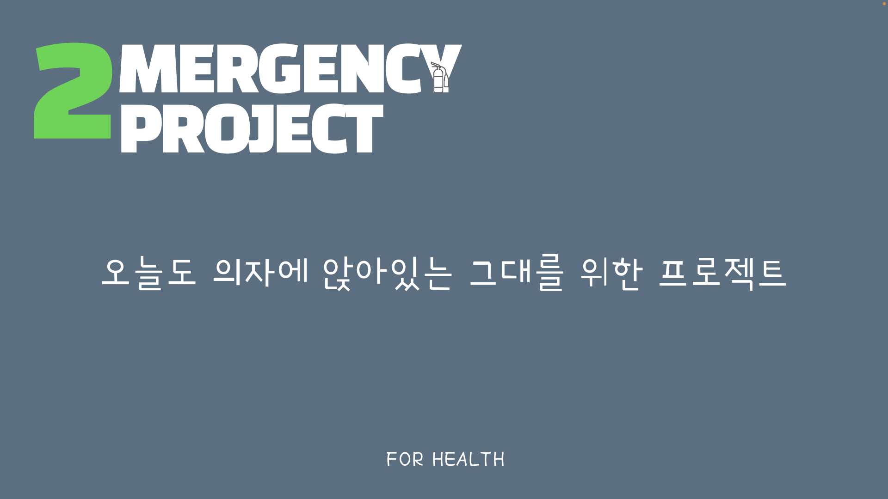
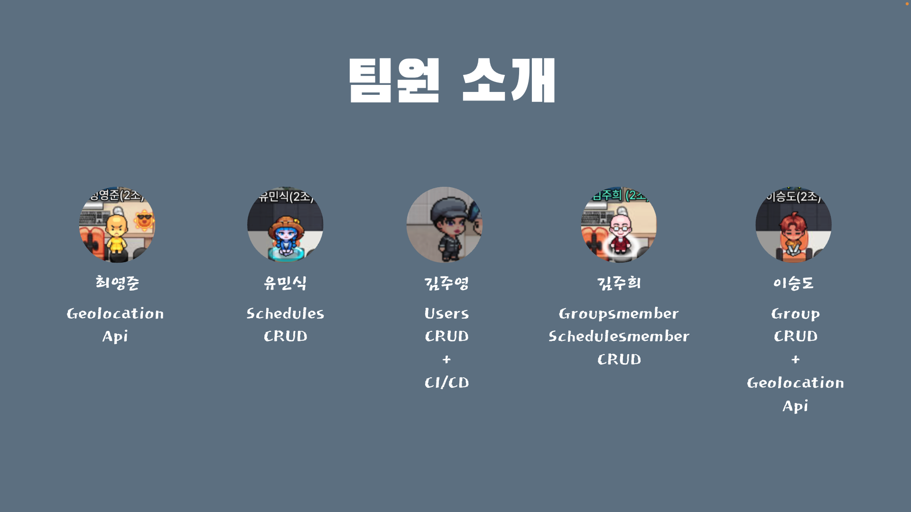
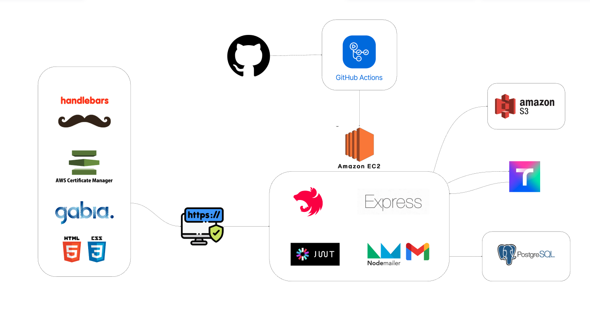

# 오늘도_의자에_앉아있는_그대를_위한 🏃‍♂️🏃‍♀️ 2MERGENCY PROJECT 🔥

<p align="center">
   
</p>


## 프로젝트 소개
__2MERGENCY_PROJECT__ 🔥 는 의자에 앉아 코딩만 하는 개발자 🧑‍💻 👩‍💻, 
수 많은 🤦‍♂️ 🤦‍♀️ 직장인들의 척추, 하체, 폐 등 건강에 🚨 __비상__ 🚨이 걸렸다는 의미로,
혼자가 아닌 커뮤니티를 이용하여 산책과 러닝, 등산을 서로 독려하며 즐겁고 건강한 생활을 할 수 있도록 돕는 목표를 가지고 이 프로젝트를 진행하였습니다.

<br/>

[ 🔥&nbsp;&nbsp;노션 ](https://www.notion.so/teamsparta/2mergency-b98d6285b838434e8382265364e0e9ec?pvs=4 "2MERGENCY PROJECT")


[ 🔥&nbsp;&nbsp;ERD ](https://drawsql.app/teams/heh-2/diagrams/youngjun "2MERGENCY PROJECT")

[ 🔥&nbsp;&nbsp;API 명세서 ](https://www.notion.so/teamsparta/55442151682547d98b339a163311924d?v=15763b8a654b4e19b4182769035d0e75&pvs=4 "2MERGENCY PROJECT")

[ 🔥&nbsp;&nbsp;Wireframe/ 플로우 차트 ](https://miro.com/app/board/uXjVKbS5It8=/ "2MERGENCY PROJECT")

<br/>

# 🗓 개발 기간

> __전체 개발 기간__ :  2024.03.26 ~ 2024.05.01
> 
> 🔧 &nbsp; 중간 발표 : 2024.04.16
> 
> 🔧 &nbsp; 최종 발표 : 2024.05.02

+ 기획, ERD, Wireframe, 플로우 차트 작성 : __03.26 ~ 03.30__

+ 기능 구현 :  __03.30 ~ 04.29__

+ 프론트 연결 작업 : __04.22 ~ 04.29__

+ 최종 점검 : __04.29 ~ 05.01__
  
<br/>
<br/>

# 📌&nbsp;2MERGENCY PROJECT 개발
<br/>
<br/>

<center>

||최영준 |유민식|김주영|김주희|이승도||
|:---:|:---:|:---:|:---:|:---:|:---:|:---:|
|블로그&nbsp;|[ 🧠&nbsp;INTP ](https://velog.io/@youngjun9310/posts "2MERGENCY PROJECT")|[ 👨‍🎨&nbsp;I(e)SFP ](https://u-kun96.tistory.com/ "2MERGENCY PROJECT")|[ 👩‍🎓&nbsp;ESTJ ](https://claire-gemstone-300.tistory.com/ "2MERGENCY PROJECT")|[ 🧝‍♀️&nbsp;INFJ ](https://unravelacomplicatedproblemm.tistory.com/ "2MERGENCY PROJECT")|[ 👨‍⚕️&nbsp;ISFJ ](https://blog.naver.com/pinmode1247 "2MERGENCY PROJECT")|
|GitHub&nbsp;|[ @youngjun9310](https://github.com/youngjun9310 "2MERGENCY PROJECT")|[ @U-Kun96 ](https://github.com/U-Kun96 "2MERGENCY PROJECT")|[ @gemstone300 ](https://github.com/gemstone300 "2MERGENCY PROJECT")|[ @juhee000 ](https://github.com/juheekim000 "2MERGENCY PROJECT")|[ @dsad233 ](https://github.com/dsad233 "2MERGENCY PROJECT")|

</center>
<br/>
<br/>
<p align="center">
   
</p>
<br/>

# 🌐 개발 환경
<p align="center">
   
</p>

<br/>

# 🔩 기술 스택

<div align=center> 

<br/>


<br>
</div>

<br/>

# 🔗 Directory Structure: 폴더 구조
<br/>

```bash

├─ .dockerignore
├─ .eslintrc.js
├─ .prettierrc
├─ docker-compose.yml
├─ Dockerfile
├─ nest-cli.json
├─ package-lock.json
├─ package.json
├─ run.sh
├─ src
│  ├─ app.controller.spec.ts
│  ├─ app.controller.ts
│  ├─ app.module.ts
│  ├─ app.service.ts
│  ├─ auth
│  │  ├─ auth.controller.spec.ts
│  │  ├─ auth.controller.ts
│  │  ├─ auth.module.ts
│  │  ├─ auth.service.spec.ts
│  │  ├─ auth.service.ts
│  │  ├─ decorator
│  │  │  └─ userInfo.decorator.ts
│  │  ├─ dto
│  │  │  ├─ login.dto.ts
│  │  │  └─ signup.dto.ts
│  │  ├─ entities
│  │  │  └─ invite.entity.ts
│  │  ├─ guard
│  │  │  ├─ jwt.guard.ts
│  │  │  └─ roles.guard.ts
│  │  └─ strategy
│  │     ├─ jwt.strategy.ts
│  │     └─ roles.strategy.ts
│  ├─ aws
│  │  ├─ aws.module.ts
│  │  ├─ aws.service.spec.ts
│  │  └─ aws.service.ts
│  ├─ const
│  │  └─ env.keys.ts
│  ├─ group-members
│  │  ├─ decorator
│  │  │  └─ memberRoles.decorator.ts
│  │  ├─ dto
│  │  │  ├─ create-group-member.dto.ts
│  │  │  ├─ invite-member.dto.ts
│  │  │  └─ update-group-member.dto copy.ts
│  │  ├─ entities
│  │  │  └─ group-member.entity.ts
│  │  ├─ group-members.controller.spec.ts
│  │  ├─ group-members.controller.ts
│  │  ├─ group-members.module.ts
│  │  ├─ group-members.service.spec.ts
│  │  ├─ group-members.service.ts
│  │  ├─ guard
│  │  │  └─ members.guard.ts
│  │  ├─ strategies
│  │  │  └─ members.strategy.ts
│  │  └─ types
│  │     └─ groupMemberRole.type.ts
│  ├─ groups
│  │  ├─ dto
│  │  │  ├─ create-group.dto.ts
│  │  │  └─ update-group.dto.ts
│  │  ├─ entities
│  │  │  └─ group.entity.ts
│  │  ├─ groups.controller.spec.ts
│  │  ├─ groups.controller.ts
│  │  ├─ groups.module.ts
│  │  ├─ groups.service.spec.ts
│  │  └─ groups.service.ts
│  ├─ mail
│  │  ├─ interface
│  │  │  └─ SendOption.ts
│  │  ├─ mail.module.ts
│  │  ├─ mail.service.spec.ts
│  │  └─ mail.service.ts
│  ├─ main.ts
│  ├─ records
│  │  ├─ dto
│  │  │  └─ create_record.dto.ts
│  │  ├─ entities
│  │  │  └─ record.entity.ts
│  │  ├─ records.controller.spec.ts
│  │  ├─ records.controller.ts
│  │  ├─ records.module.ts
│  │  ├─ records.service.spec.ts
│  │  └─ records.service.ts
│  ├─ schedule-members
│  │  ├─ dto
│  │  │  ├─ create-schedule-member.dto.ts
│  │  │  └─ update-schedule-member.dto.ts
│  │  ├─ entities
│  │  │  └─ schedule-member.entity.ts
│  │  ├─ schedule-members.controller.spec.ts
│  │  ├─ schedule-members.controller.ts
│  │  ├─ schedule-members.module.ts
│  │  ├─ schedule-members.service.spec.ts
│  │  └─ schedule-members.service.ts
│  ├─ schedules
│  │  ├─ dto
│  │  │  ├─ create-schedule.dto.ts
│  │  │  ├─ schedule.dto.ts
│  │  │  └─ update-schedule.dto.ts
│  │  ├─ entities
│  │  │  └─ schedule.entity.ts
│  │  ├─ schedules.controller.spec.ts
│  │  ├─ schedules.controller.ts
│  │  ├─ schedules.module.ts
│  │  ├─ schedules.service.spec.ts
│  │  └─ schedules.service.ts
│  ├─ types
│  │  └─ Category.type.ts
│  ├─ users
│  │  ├─ dto
│  │  │  ├─ delete.dto.ts
│  │  │  ├─ login.dto.ts
│  │  │  ├─ signup.dto.ts
│  │  │  └─ update.dto.ts
│  │  ├─ entities
│  │  │  ├─ invite.entity.ts
│  │  │  └─ user.entity.ts
│  │  ├─ types
│  │  │  └─ userRole.type.ts
│  │  ├─ users.controller.spec.ts
│  │  ├─ users.controller.ts
│  │  ├─ users.module.ts
│  │  ├─ users.service.spec.ts
│  │  └─ users.service.ts
│  └─ utils
│     └─ swagger
│        └─ swagger.ts
├─ test
│  ├─ app.e2e-spec.ts
│  └─ jest-e2e.json
├─ tsconfig.build.json
├─ tsconfig.json
└─ views
├─ group-members_h
│  ├─ groupaccept.hbs
│  └─ groupinvite.hbs
├─ groups_h
│  ├─ groupall.hbs
│  ├─ groupcreate.hbs
│  ├─ groupEdit.hbs
│  └─ grouplist.hbs
├─ index.hbs
├─ records_h
│  ├─ recordall.hbs
│  ├─ recordcreate.hbs
│  └─ recordlist.hbs
├─ schedules_h
│  ├─ scheduleall.hbs
│  ├─ schedulecreate.hbs
│  ├─ scheduleEdit.hbs
│  └─ schedulelist.hbs
├─ users_h
│  ├─ emailaccept.hbs  
│  ├─ emailsend.hbs
│  ├─ login.hbs
│  ├─ registerpage.hbs
│  ├─ userall.hbs
│  ├─ userDashboard.hbs
│  ├─ userDelete.hbs
│  ├─ userEdit.hbs
│  └─ usermypage.hbs
└─ welcomePage.hbs

```
<br/>

# 📌 역할 분담

> 👑 이승도 
+ hbs(handlebars), 
+ geolocation api, 
+ records crud, 
+ groups crud, 
+ AJAX 데이터 전송 방식, 
+ nodemailer, 
+ swagger
+ 🔥 팀 프로젝트 총괄

> ⭐️ 김주영
+ user crud, 
+ Amazon S3, 
+ nodemailer,
+ 프론트 : handlebars,
+ 배포: ec2,rds,git-action, 
+ https 적용: aws acl, route53,

> 유민식
+ schedule crud, 
+ crud 코드 리팩토링, 
+ schedule crud test 코드 일부 작성, 
+ API 명세서 정리 
+ 팀원 서포트

> 김주희
+ groups crud -수정/ 다듬기
+ groupsMembers crud
+ swagger -수정/ 다듬기
+ Auth crud test 코드 작성
+ 노션 정리
+ README 작성

> 최영준
+ geolocation api


<br/>

# 🖋 프로젝트 후기

> 이승도 
+ 처음에는 프로젝트의 방향성을 제대로 찾아보느라 시간이 많이 걸렸던 것 같고
나만의 판단 하나 하나가 중요하다는 것을 깨달았습니다. 프로젝트를 진행하면서 어려운 부분은 굉장히 많았으나, 그 만큼 시간 투자를 해보면서 접해보지 못한 기능 구현을 해보는 것이 좋았습니다. 그 중에서, Geolocation api (Tmap) 데이터를 Ajax 전송 메소드를 사용해보면서 지도의 좌표 x, y 위도 경도 값, 추적 시작 시간과 추적 종료의 시간 값 데이터를 데이터베이스에 저장시켜주는 방식등을 해보면서 프론트 부분과 백엔드 부분의 데이터 연결성을 확인해볼 수 있어서 좋았던 것 같습니다

> 김주영
+ 프로젝트를 참여하며 기술 하나하나의 선택과 결정의 근거를 세우는 과정의 중요성을 경험했습니다. 어떠한 기술을 선택할 때, 정답은 없다는 점에서 단순히 배웠기 때문에 사용하는 것이 아닌 우리가 만들 서비스에 부합한다는 관점으로 바라봐야한다는 것을 배웠습니다.
나아가 앞으로 기술을 습득할 때에는 해당 기술의 등장 배경, 상황에 따른 장단점을 명확히 파악하는 방향으로 학습할 것 같습니다.

> 유민식
+ 할 수 있는 부분이 매우 일부분이어서 담당한 파트를 하는 것도 너무 벅차고 이해도가 너무 낮아서 프로젝트에 기여한 부분이 굉장히 적어 팀원들에게 짐만 되는 것 같아서 굉장히 미안했음. 나도 할 수 있다 같은 긍정적인 부분 보다 부정적인 감정을 더 많이 느낀 프로젝트 였음.

> 김주희
+ 팀 프로젝트의 체계적인 설계의 중요성을 느꼈습니다. 또한 기획과 아이디어가 너무 현 실력과 동떨어져 있으면 안 된다는 사실을 다시 한번 몸으로 익히는 시간이었습니다. 아무리 상황이 최악이라도, 마감 기한에 맞추기 위해서는 계속 상의하며 우리가 할 수 있는 최선을 만들어내야 하기 때문에 무엇보다 중요한 것은 소통, 실력이 떨어지든, 잘하든 팀원이라면 함께 소통을 무조건 해야 한다는 사실… 아무튼, 정말... 여러 많은 일이 있었지만 스스로 최대한 노력해보고 문제가 생기면 팀원들과 함께 해결해 나가면서 협업의 장점을 체감할 수 있어 좋았습니다. 그리고 함께 고생한 조원들 모두 너무 고생 많으셨습니다. 제가 부족해서 도움이 되지 못해 정말 죄송한 마음 뿐입니다. 그래도 2023-24년 스파르타 부트캠프 기간 중, 가장 치열한 한 달이었습니다. 모두 남은 기간도 잘 마무리 해서 유종의 미를 거둘 수 있길 바랍니다. 이후 모든 앞길에 행운이 가득하길 바랍니다. 너무 고생많으셨습니다.!

> 최영준
+ 지금까지 기술에 대해 궁금함보다는 일단 빠르게 만들기 위한 이해를 더 많이 하고있었다는 것 을 깨달았습니다. 기술 하나하나에 왜 그 기술을 쓰는지가 중요하다는 것이 처음에는 엄청나게 껄끄러웠습니다. 시간이 지나며 고찰을 하는 습관을 가지게 되었습니다. 한달이 넘는 프로젝트이다보니, 중간에 루즈해지기도 하고, 시간에 쫓기기도 하며, 팀원과 함께 프로젝트를 하다보니, 실력과 팀프로젝트에서 가져야 할 마음가짐 같은 여러가지를 얻게 되었습니다. 지금까지 여러 프로젝트를 해오면서, 여러가지 기술을 배웠으니, 이제 제대로 혼자 만들고 싶은 프로젝트를 해봐야겠다는 생각을 하고있습니다.